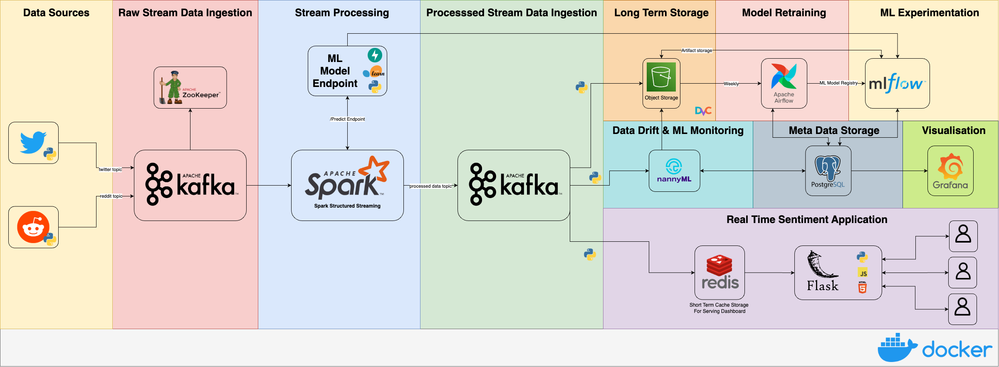

# sentiment-stream
An end-to-end real-time data streaming pipeline that leverages Kafka and Spark Streaming to analyse social media sentiment trends. 

What I am building, still a proj in progress:




## To Run
   - Ensure Docker is installed and running
   - Some .env config will need to be done, and setting up api keys for reddit and MinIO
   - Run `docker-compose up --build` file


## Configuring the ZenML Stack
Next steps are to configure ZenML to use:
   - S3 as the artifact store
   - MLFlow as the model registry
   - MLFlow as the experiment tracker
   - Docker as the orchestrator

Ensure you have the ZenML server running.

From your client machine, ensure you have zenml installed by running:

`uv add zenml`

Next we need to connect to the zenml server. You can do this by running:

`zenml login http://localhost:8082`

This should take you to your browser, where you need to confirm access.

Then we need to install the zenml integrations for MLFlow, S3.

`zenml integration install mlflow s3 --uv`

Next is to register the artifact store, since we are using a selfhosted MinIO, it can be done like this:

```
zenml artifact-store register minio_store -f s3 --path='s3://zenml' --authentication_secret=s3_secret --client_kwargs='{"endpoint_url": "http://localhost:9000"}'
```

Make sure to configure your zenml secret. You can do this easily via the UI.
