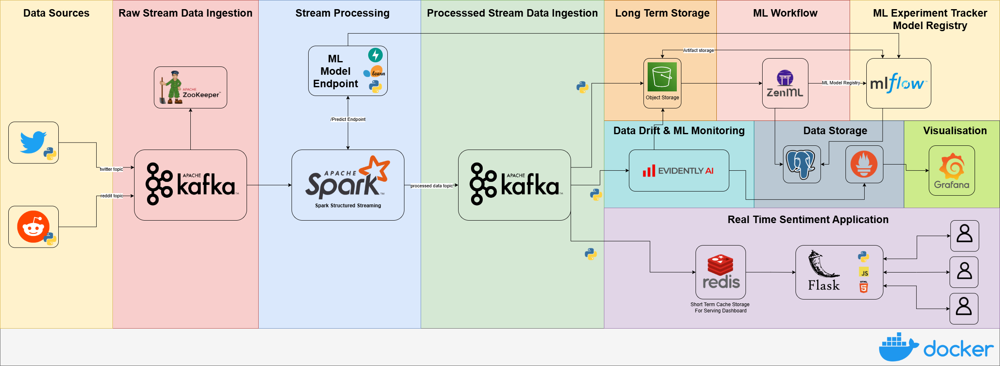

# sentiment-stream
An end-to-end real-time data streaming pipeline that leverages Kafka and Spark Streaming to analyse social media sentiment trends. 

What I am building:

## Architecture

1. **Data Sources**:
   - Twitter and Reddit are the data sources. But more can be added. 

2. **Stream Data Ingestion**:
   - **Apache Kafka** is used to handle incoming data streams. Each source gets sent to its respective topic  (`twitter-topic` and `reddit-topic`).
   - **Apache ZooKeeper** manages Kafka brokers.

3. **Stream Processing**:
   - **Apache Spark** processes the streaming data using Spark Structured Streaming.
   - Processed data is stored in:
     - **Object Storage** for long-term persistence.
     - **Redis** for short-term persistence.

4. **Real-Time Dashboard**:
   - **Redis** serves as a short-term cache for fast data retrieval.
   - **Flask** handles backend operations for the dashboard.
   - Frontend is in **HTML**, **CSS**, and **JavaScript**.

5. **End Users**:
   - Users access the dashboard via a web interface served by **Nginx**.

## To Run
   - Ensure Docker is installed and running
   - Some .env config will need to be done, and setting up api keys for reddit and MinIO
   - Run `docker-compose up --build` file

## Configuring the ZenML Stack
Next steps are to configure ZenML to use:
   - S3 as the artifact store
   - MLFlow as the model registry
   - MLFlow as the experiment tracker
   - Docker as the orchestrator

Ensure you have the ZenML server running.

From your client machine, ensure you have zenml installed by running:

`uv add zenml`

Next we need to connect to the zenml server. You can do this by running:

`zenml login http://localhost:8082`

This should take you to your browser, where you need to confirm access.

Then we need to install the zenml integrations for MLFlow, S3.

`zenml integration install mlflow s3 --uv`
